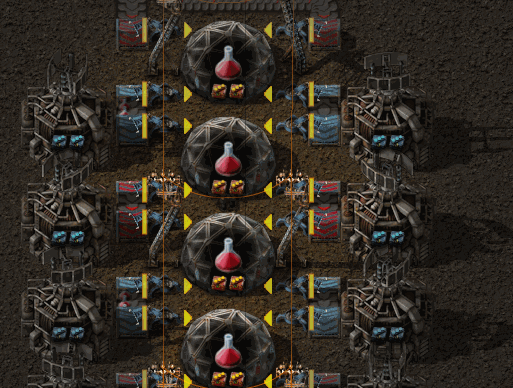
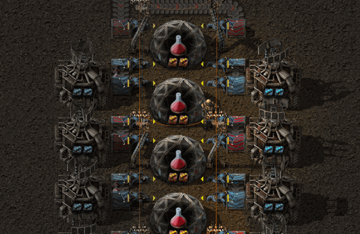
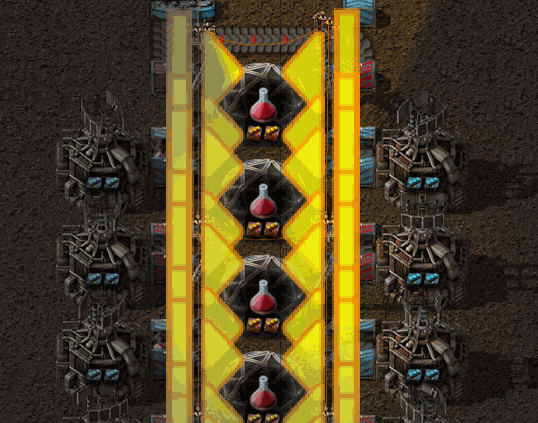
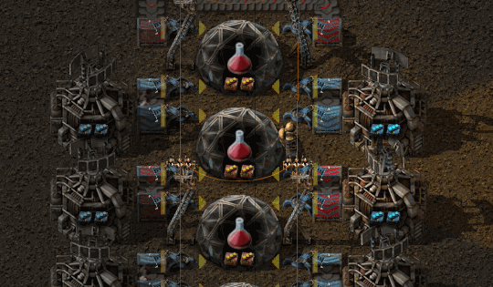

# Arrow Tweaker

Ever thought the inserter arrows displayed in info mode (activated with the ALT
key) are too large and obstruct your view of your factory? Ever thought they
are too small and hard to see when zoomed out?

Either way, this mod lets you change the size of those arrows, from tiny

to absurdly huge.

Or maybe you're happy with the size of the arrows, but would like them to be a bit more transparent?

